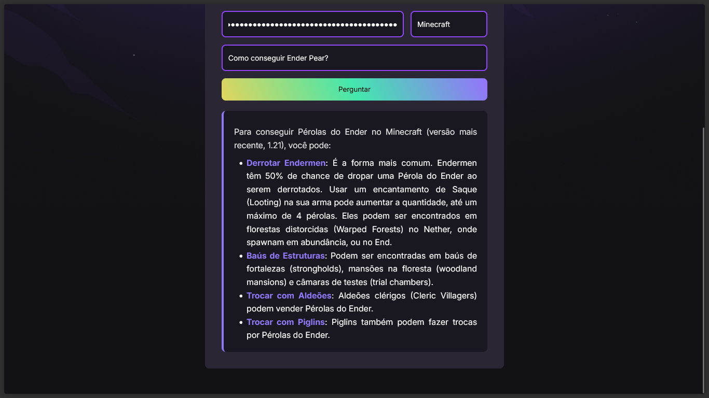

# Assistente Meta de Jogos 

Projeto desenvolvido durante a **NLW 20 (20ª edição)** da [Rocketseat](https://rocketseat.com.br/).

## Sobre

Este projeto é um assistente inteligente para responder dúvidas, dar dicas, sugerir estratégias e builds para jogos como **GTA5**, **Minecraft** e **CS:GO**.  
Utiliza a API do **Gemini 2.5 Flash** para gerar respostas rápidas, atualizadas e precisas, com engenharia de prompt para garantir informações relevantes e atuais sobre cada jogo.

## Funcionalidades

- Responde perguntas sobre estratégias, builds e dicas dos jogos suportados.
- Busca sempre a informação mais recente, considerando a data atual.
- Responde apenas perguntas relacionadas ao jogo selecionado.
- Interface simples e intuitiva.

## Tecnologias Utilizadas

- **HTML, CSS e JavaScript**
- [Showdown.js](https://github.com/showdownjs/showdown) para conversão de Markdown em HTML
- **API Gemini 2.5 Flash** (Google)
- Prompt Engineering para garantir respostas de qualidade

## Como usar

1. Clone o repositório.
2. Abra o arquivo `index.html` em seu navegador.
3. Insira sua **API KEY** do Gemini.
4. Selecione o jogo desejado.
5. Faça sua pergunta e receba a resposta do assistente!

## Site junto ao GitHub Pages
Para visualizar o site acesse: 

```sh
https://higormauricio.github.io/Assistente_IA-NLW/
```

1. Insira sua **API KEY** do Gemini.
2. Selecione o jogo desejado.
3. Faça sua pergunta e receba a resposta do assistente!

## Layout




*Este projeto foi desenvolvido para fins educacionais durante o evento NLW20 da Rocketseat.*
